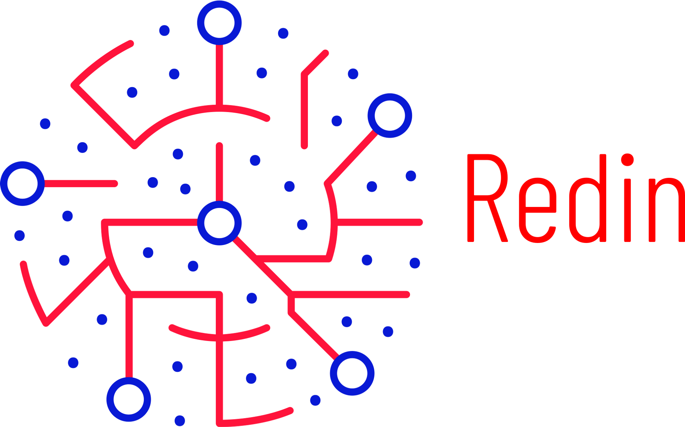

<div style="text-align: center">


</div>

Redin is a simple dependency injection framework, instead of having a bunch of features, we provide a limited set of features that must be enough for the majority of projects, mainly the smaller ones.

## Basic injection

Redin provides a Kotlin DSL for declaration of dependencies:

```kotlin
val injector = Redin {
    bind<AccountService>() toImplementation(AccountServiceImpl::class.java)
}

val serviceProvider = injector.provide<AccountService>()
```

Note that, the `provide` function returns a function that, when invoked, produces the underlying requested dependency. This means that, every time you do `serviceProvider()` it creates a new instance of this service.

If that is not what you want, you could use `scopes` to define the scope of the dependency. Once an instance of a dependency is produced in a given scope, the instance keeps tied to that scope. So, calling the `serviceProvider` always yields the same dependency instance. The most commonly used scope is `SINGLETON`:

```kotlin
val injector = Redin {
    bind<AccountService>() inScope SINGLETON toImplementation(AccountServiceImpl::class.java)
}

val service = injector.provide<AccountService>(scope = SINGLETON)
```

Also, you could use qualifiers to identify between different instances of the same type of dependency, for example, for services urls:

```kotlin
val injector = Redin {
    bind<String>() qualifiedWith Name("accountService") inScope SINGLETON toValue "https://service/"
    bind<String>() qualifiedWith Name("transactionService") inScope SINGLETON toValue "https://service2/"
}

val service = injector.provide<String>(
    scope = SINGLETON,
    qualifiers = listOf(nameContainer("transactionService"))
)
```

### Injecting in classes

To use class injection, you need to annotate the constructor to be used to inject the dependencies with `@Inject`, see an example below:

```kotlin
data class Account(val id: Long)

interface AccountService {
    fun deposit(account: Account, amount: Long)
}


class AccountServiceImpl : AccountService {
    override fun deposit(account: Account, amount: Long) {
        // Deposit logic
    }
}

class BankService @Inject constructor(val accountService: AccountService)

fun inject() {
    val injector = Redin {
        bind<AccountService>() inScope SINGLETON toImplementation(AccountServiceImpl::class.java)
        bind<BankService>() inScope SINGLETON toImplementation(BankService::class.java)
    }

    val accountService = injector.provide<AccountService>(scope = SINGLETON)
    val bankService = injector.provide<BankService>(scope = SINGLETON)
}
```


## Adding more bindings to existing injector

To add more bindings, just call `bind` method, it will create a new `BindContext`:

```kotlin
fun inject() {
    val injector = Redin {
        bind<AccountService>() inScope SINGLETON toImplementation(AccountServiceImpl::class.java)
    }

    val accountService = injector.provide<AccountService>(scope = SINGLETON)
    injector.bind {
        bind<BankService>() inScope SINGLETON toImplementation(BankService::class.java)
    }

    val bankService = injector.provide<BankService>(scope = SINGLETON)
}
```

## Child injectors

Child injectors could be used to inherit dependencies from a parent injector, while providing a whole new scope of dependencies. One example of usage of child injector is in plugin system, to provide a dedicated `Logger` for every plugin.

The example below shows an example of a “plugin system” taking advantage of child injectors:

```kotlin
data class Project(val name: String)
abstract class Plugin {
    abstract fun init()
}
class PluginA @Inject constructor(val logger: Logger, val project: Project, val injector: Injector): Plugin() {
    override fun init() {
        logger.info("Plugin A initialized for project ‘${this.project.name}’!")
    }
}
class PluginB @Inject constructor(val logger: Logger, val project: Project, val injector: Injector): Plugin() {
    override fun init() {
        logger.info("Plugin B initialized for project ‘${this.project.name}’!")
    }
}

val injector = Redin {
    bind<Project>() inScope SINGLETON toValue Project("Test")
}

val pluginClasses = listOf(PluginA::class.java, PluginB::class.java)
val pluginInstances = mutableListOf<Plugin>()

for (pluginClass in pluginClasses) {
    val pluginInjector = injector.child {
        bind<Logger>().inSingletonScope().toValue(Logger.getLogger(pluginClass.name))
    }

    pluginInstances.add(pluginInjector[pluginClass])
}


pluginInstances.forEach(Plugin::init)
```

### Retrieving all bindings of a given type

In scenarios like this one, you may want to retrieve all `Plugin` instances. Redin tries to not introduce any unexpected behavior, then a regular binding won't work, since binding to the same type overwrites the previous binding. To access all instances of a given type, you need to register a binding for a provider which carries all those instances.

You can also use [qualifiers](qualifiers.md) to automatically provide these instances using an identifier as well.

The example below shows how to provide all instances of a given type through a `List`, as well as using qualifiers to provide dedicated bindings:

```kotlin
data class Project(val name: String)
abstract class Plugin {
    abstract val id: String
    abstract fun init()
}
class PluginA @Inject constructor(val logger: Logger, val project: Project, val injector: Injector): Plugin() {
    override val id: String = "com.example.PluginA"

    override fun init() {
        logger.info("Plugin A initialized for project ‘${this.project.name}’!")
    }
}
class PluginB @Inject constructor(val logger: Logger, val project: Project, val injector: Injector): Plugin() {
    override val id: String = "com.example.PluginB"

    override fun init() {
        logger.info("Plugin B initialized for project ‘${this.project.name}’!")
    }
}
class PluginC @Inject constructor(val logger: Logger,
                                  val project: Project,
                                  @Named("com.example.PluginB") val pluginB: Plugin,
                                  val injector: Injector): Plugin() {
    override val id: String = "com.example.PluginC"

    override fun init() {
        logger.info("Plugin C initialized for project ‘${this.project.name}’!")
    }
}

val injector = Redin {
    bind<Project>() inScope SINGLETON toValue Project("Test")
}

val pluginClasses = listOf(PluginA::class.java, PluginB::class.java, PluginC::class.java)
val pluginInstances = mutableListOf<Plugin>()

injector.bind {
    bindReified<List<Plugin>>().inSingletonScope().toProvider { pluginInstances }
}

for (pluginClass in pluginClasses) {
    val pluginInjector = injector.child {
        bind<Logger>().inSingletonScope().toValue(Logger.getLogger(pluginClass.name))
    }

    val pluginInstance = pluginInjector[pluginClass]
    pluginInstances.add(pluginInjector[pluginClass])

    injector.bind {
        bind<Plugin>().inSingletonScope().qualifiedWith(Name(pluginInstance.id)).toValue(pluginInstance)
    }
}


pluginInstances.forEach(Plugin::init)

class PluginSystem @Inject constructor(@Singleton val plugins: List<Plugin>)

injector.bind {
    bind<PluginSystem>().inSingletonScope().toImplementation<PluginSystem>()
}

val system = injector.provide<PluginSystem>(scope = SINGLETON)()
```

The `bindReified` function is used when you want to bind keeping the generic type information, rather than erasing the type information. You could also use `bind(TypeInfo.builderOf(List::class.java).of(Plugin::class.java).buildGeneric())`


## Late binding

Redin also supports late binding mechanism, it does by injecting the dependencies when they are needed, instead of injecting them right in the construction time:

```kotlin
class MyPlugin @Inject constructor(@Late val globalLogger: LateInit.Ref<Logger>) {

    fun log(message: String) {
        this.globalLogger.value.info("MyPlugin: ‘$message’")
    }

}

fun lateInject() {
    val injector = Redin {
        bind<MyPlugin>().inSingletonScope().toImplementation<MyPlugin>()
    }

    val myPlugin = injector.provide<MyPlugin>(scope = SINGLETON)()

    //myPlugin.log("Hello") // will fail

    injector.bind {
        bind<Logger>().inSingletonScope().toValue(Logger.getGlobal())
    }

    myPlugin.log("Hello") // works!

}
```

## Lazy binding

Works in the same way as *late binding*:

```kotlin
class MyPlugin @Inject constructor(@LazyDep val globalLogger: Lazy<Logger>) {

    fun log(message: String) {
        this.globalLogger.value.info("MyPlugin: ‘$message’")
    }

}


fun lazyInject() {
    val injector = Redin {
        bind<MyPlugin>().inSingletonScope().toImplementation<MyPlugin>()
    }

    val myPlugin = injector.provide<MyPlugin>(scope = SINGLETON)()

    myPlugin.log("Hello") // will fail

    injector.bind {
        bind<Logger>().inSingletonScope().toValue(Logger.getGlobal())
    }

    myPlugin.log("Hello") // works!

}
```

The main difference is that *late injection* is handled by `Injector`, when new bindings are added, the engine tries to resolve *late injection points*, while *lazy injection* is handled by a `Lazy` implementation that search by available binding at the first use. In other words, while *late injection* is resolved as soon as a candidate is provided, *lazy injection* is only resolved when the value is used.

In practice, you could choose between *late* or *lazy*, but it only applies when using `LateInit` or Kotlin `Lazy` types: Lazy bindings are also candidates for dynamic generation, so the code below works fine:

```kotlin
interface Logger {
    fun info(message: String)
}

class MyPlugin @Inject constructor(@LazyDep val globalLogger: Logger) {

    fun log(message: String) {
        this.globalLogger.info("MyPlugin: ‘$message’")
    }

}

fun dynamicLazyInject() {
    val injector = Redin {
        bind<MyPlugin>().inSingletonScope().toImplementation<MyPlugin>()
    }

    val myPlugin = injector.provide<MyPlugin>(scope = SINGLETON)()

    //myPlugin.log("Hello") // will fail

    injector.bind {
        bind<Logger>().inSingletonScope().toValue(object : Logger {
            override fun info(message: String) {
                java.util.logging.Logger.getGlobal().info(message)
            }
        })
    }

    myPlugin.log("Hello") // works!

}
```

Redin uses [KoresProxy](https://github.com/koresframework/KoresProxy) to generate dynamic implementation. However, while this may sound that invocations are dynamic, they are not: Redin generates proxies that uses static invocation, so there is no performance overhead in using them.

## Hot Swap

Redin allows for switching existing injections into new ones, this is possible through `HotSwappable`. 

```kotlin
interface Logger {
    fun info(message: String)
}

class PrefixedLogger(val prefix: String): Logger {
    override fun info(message: String) {
        println("$prefix: $message")
    }
}

class MyPlugin @Inject constructor(@HotSwappable val globalLogger: Hot<Logger>) {

    fun log(message: String) {
        this.globalLogger.value.info("MyPlugin: ‘$message’")
    }

}


fun hotInject() {
    val injector = Redin {
        bind<Logger>().inSingletonScope().toValue(PrefixedLogger("First"))
        bind<MyPlugin>().inSingletonScope().toImplementation<MyPlugin>()
    }

    val myPlugin = injector.provide<MyPlugin>(scope = SINGLETON)()

    myPlugin.log("Hello")

    injector.bind {
        bind<Logger>().inSingletonScope().toValue(PrefixedLogger("Swapped"))
    }

    myPlugin.log("Hello")

}
```

Proxies can be used like in *lazy injection*, with zero runtime overhead (only class generation overhead, which happens only once in the entire execution):

```kotlin
interface Logger {
    fun info(message: String)
}

class PrefixedLogger(val prefix: String): Logger {
    override fun info(message: String) {
        println("$prefix: $message")
    }
}

class MyPlugin @Inject constructor(@HotSwappable val globalLogger: Logger) {

    fun log(message: String) {
        this.globalLogger.info("MyPlugin: ‘$message’")
    }

}


@Test
fun hotInject() {
    val injector = Redin {
        bind<Logger>().inSingletonScope().toValue(PrefixedLogger("First"))
        bind<MyPlugin>().inSingletonScope().toImplementation<MyPlugin>()
    }

    val myPlugin = injector.provide<MyPlugin>(scope = SINGLETON)()

    myPlugin.log("Hello")

    injector.bind {
        bind<Logger>().inSingletonScope().toValue(PrefixedLogger("Swapped"))
    }

    myPlugin.log("Hello")

}
```

## Module

Redin supports module-like bind declaration:

```kotlin
@RedinInject
class Example(val log: LoggingService)
class MyModule {
    @Provides
    @Singleton
    fun provideLoggingService(): LoggingService = MyLoggingService()
}

fun example() {
    val injector = Redin {
        module(MyModule())
    }
    
    val example = injector.get<Example>()
}
```

## `get` vs `provide`

The `get` function is used to create an instance of a class injecting dependencies as needed, while `provide` is used to retrieve a dependency declared in `BindContext`:

```kotlin
class MyService @Inject constructor(val logger: Logger)

class MyService2 @Inject constructor(val myService: MyService)

@Test
fun getVsProvideInject() {
    val injector = Redin {
        bind<Logger>().inSingletonScope().toValue(Logger.getGlobal())
    }
    
    // Creates a new instance of MyService injecting dependencies
    val myService = injector.get<MyService>()
    // Won't work since there is no binding for ‘MyService’.
    val myServiceProvided = injector.provide<MyService>(scope = SINGLETON)()
    // Won't work since there is no binding for ‘MyService’ to inject in ‘MyService2’.
    val myService2 = injector.get<MyService2>()

}
```

The right way to write the could above is:

```kotlin
class MyService @Inject constructor(val logger: Logger)

class MyService2 @Inject constructor(val myService: MyService)

fun getVsProvideInject() {
    val injector = Redin {
        bind<Logger>().inSingletonScope().toValue(Logger.getGlobal())
        bindToImplementation<MyService>(scope = SINGLETON)
    }

    val myService = injector.provide<MyService>(scope = SINGLETON)()
    val myServiceProvided = injector.provide<MyService>(scope = SINGLETON)()
    val myService2 = injector.get<MyService2>()

}
```

## Lazy by default

Redin resolves dependencies lazily by default, this means that the following code works:

```kotlin

class MyService @Inject constructor(val logger: Logger)

fun lazyByDefaultInject() {
    val injector = Redin {
        bind<Logger>().inSingletonScope().toValue(Logger.getGlobal())
    }

    val myService = injector.provide<MyService>(scope = SINGLETON)

    injector.bind {
        bindToImplementation<MyService>(scope = SINGLETON)
    }

    myService()

}
```

Resolution only occurs when the provider function is invoked. However, since classes does not have this indirection, they always resolve dependencies in instantiation (unless they have `@Late` or `@Lazy` dependencies).